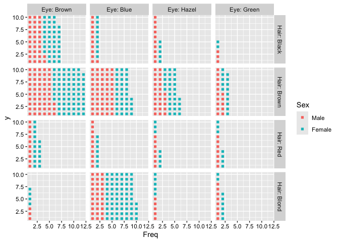
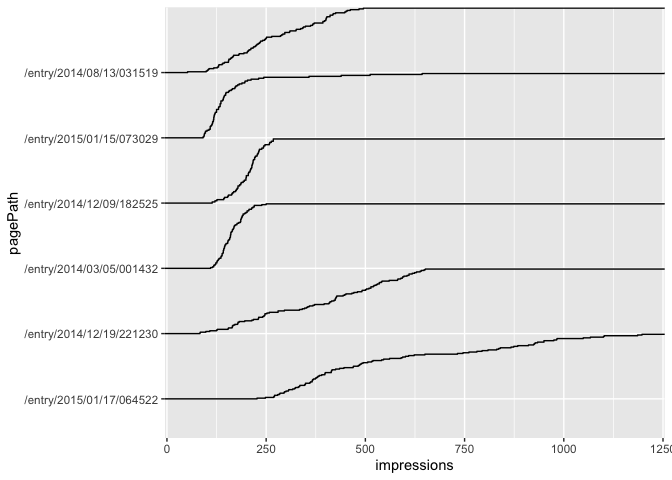
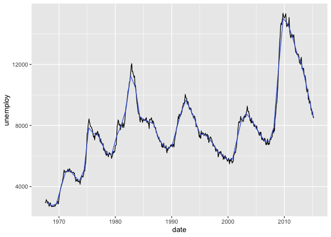

Chart gallaley
================
Ko ABE
2024-02-26

## icon array

`stat_countgrid` is used to plot icon array.

``` r
library(ggsomestat)
```

    ## Loading required package: ggplot2

``` r
HEC <- as.data.frame(HairEyeColor)
ggplot(HEC, aes(x=Freq, colour=Sex))+
  stat_countgrid(shape=15)+
  facet_grid(Hair~Eye, labeller = label_both)+
  ggsomestat:::axis_text_black()
```

<!-- -->

``` r
ggplot(HEC, aes(x=Freq, fill=Sex))+
  stat_countgrid(geom="tile", width=0.9, height=0.9)+
  facet_grid(Hair~Eye, labeller = label_both)
```

<!-- -->

``` r
ggplot(HEC, aes(x=Freq, label=substr(Sex,1,1)))+
  stat_countgrid(geom="text",size=3)+
  facet_grid(Hair~Eye, labeller = label_both)+
  theme_bw()+
  ggsomestat:::axis_text_black()
```

<!-- -->

## ecdf

`stat_ecdf2` draws parallel ecdf plot.

``` r
ggplot(searchConsole, aes(impressions, pagePath)) +
  stat_ecdf2()
```

<!-- -->

## binomial confidence interval

``` r
entry0117 <- searchConsole[searchConsole$pagePath=="/entry/2015/01/17/064522",]
ggplot(entry0117, aes(date, clicks/impressions)) +
  geom_line()+
  stat_binomCI(geom = "ribbon", aes(numerator=clicks, denominator=impressions), alpha=0.3)
```

<!-- -->

## moving avarage

``` r
ggplot(economics, aes(date, unemploy)) +
  geom_line()+
  stat_ma(colour="royalblue", windowsize=300)
```

<!-- --> \## sparkline

`stat?sparkline` draws the parallel line charts

``` r
ggplot(searchConsole, aes(x = date, y = pagePath, inner_y = clicks)) +
  stat_sparkline()
```

<!-- -->

``` r
ggplot(searchConsole, aes(x = date, y = pagePath, inner_y = clicks)) +
  stat_sparkline()+
  axis_text_black()
```

<!-- -->
